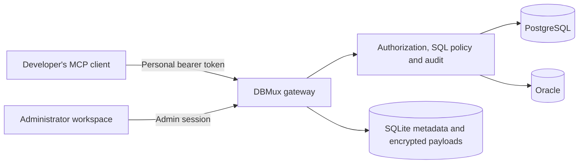

# DBMux

### Your development databases, connected to your AI coding workflow.

[](LICENSE)
[](package.json)
[](tsconfig.json)
[](docs/mcp-clients.md)

**DBMux is a self-hosted MCP gateway for PostgreSQL and Oracle development databases.** Give your coding agent schema context, bounded SQL queries, reviewed changes and an audit trail through one endpoint. Keep database credentials on your server and give each developer a personal, scoped, revocable token.

Use it to understand an unfamiliar schema, build a feature against a shared development database, or review the database changes made during a coding session.

[Quick start](#quick-start) · [Developer setup](#connect-your-coding-client) · [Tools](#tools-at-a-glance) · [Documentation](#documentation) · [Contributing](CONTRIBUTING.md)

> **Project status:** early development, version 0.1.0. PostgreSQL has live integration coverage. The Oracle Thin adapter is implemented, but live Oracle 19c acceptance remains outstanding. Production use requires Oracle acceptance where applicable and a deployment-specific security review. See [verification and limitations](docs/verification.md).

## Why DBMux?

- **Bring the database into your coding workflow.** Inspect tables, relationships, indexes and stored source from an MCP-compatible client.
- **Share access without sharing database passwords.** Administrators configure connections once; developers receive individual tokens with explicit connection and operation grants.
- **Start with read-only access.** Enable writes deliberately, preview SQL and require confirmation for high-risk changes.
- **Keep the context behind a change.** Capture schema snapshots, compare definitions, attach project/branch context and export recorded SQL with its bind manifest.
- **Operate from one browser workspace.** Manage connections, tokens, effective access, activity and request timelines.
- **Run on your own infrastructure.** A Node.js service, SQLite metadata store and optional Docker deployment; developers need no local database drivers.

## How it works



Administrators manage database credentials. Developers use the authenticated `/mcp` endpoint. Each tool call rechecks token scope, connection enablement and effective permissions. User SQL passes through the central policy and audit layers before an adapter executes it.

DBMux supplements least-privilege database accounts and network isolation. Schema restrictions and SQL classification cannot eliminate indirect effects from database objects such as triggers or functions. Read the [security model](docs/security.md) before granting write access.

## Quick start

Already have a team endpoint and personal token? Go directly to [developer setup](#connect-your-coding-client).

To run your own instance, you need **Node.js 24 LTS** (24.15.0 or later, below 25), **npm**, **Git**, and access to a development database. Docker with Compose is optional. DBMux does not provision your application database.

### 1. Clone and configure

```bash
git clone https://github.com/MohamedRF/DBMux.git
cd DBMux
npm ci
```

Create a local environment file and two independent random values. Run **one** of these blocks for a fresh checkout:

**macOS / Linux**

```bash
cp .env.example .env
mkdir -p secrets
node -e "require('node:fs').writeFileSync('secrets/mcp_master_key.txt', require('node:crypto').randomBytes(32).toString('hex') + '\n', { flag: 'wx', mode: 0o600 })"
node -e "const fs = require('node:fs'); const token = require('node:crypto').randomBytes(32).toString('hex'); fs.writeFileSync('.env', fs.readFileSync('.env', 'utf8').replace(/^SETUP_TOKEN=.*$/m, 'SETUP_TOKEN=' + token).replace(/^PUBLIC_URL=.*$/m, 'PUBLIC_URL=http://localhost:3000'))"
chmod 600 .env
```

**Windows PowerShell**

```powershell
Copy-Item .env.example .env
New-Item -ItemType Directory -Force secrets | Out-Null
node -e "require('node:fs').writeFileSync('secrets/mcp_master_key.txt', require('node:crypto').randomBytes(32).toString('hex') + '\n', { flag: 'wx', mode: 0o600 })"
node -e "const fs = require('node:fs'); const token = require('node:crypto').randomBytes(32).toString('hex'); fs.writeFileSync('.env', fs.readFileSync('.env', 'utf8').replace(/^SETUP_TOKEN=.*$/m, 'SETUP_TOKEN=' + token).replace(/^PUBLIC_URL=.*$/m, 'PUBLIC_URL=http://localhost:3000'))"
```

These commands write secrets locally without printing them. Key creation fails if the key file already exists. For an existing installation, preserve the original `.env` and master key. On Windows, restrict access to both files using your filesystem permissions.

### 2. Start the gateway

For local development:

```bash
npm run dev
```

Open [http://localhost:3000](http://localhost:3000). Read `SETUP_TOKEN` from your local `.env`, enter it in the first-time setup screen, and create an administrator account with a password of at least 14 characters. Use that account for subsequent sign-ins.

For a compiled local run:

```bash
npm run build
node --env-file=.env dist/src/main.js
```

`npm start` does not automatically load `.env`; the explicit command above does.

### Docker alternative

After step 1, set `PUBLIC_URL=http://localhost:3001` in `.env`. On macOS/Linux create the persistent directory with `mkdir -p dbmux_data`; on PowerShell use `New-Item -ItemType Directory -Force dbmux_data`.

For standard rootful Docker on Linux, allow the container's non-root user to read the key and write metadata:

```bash
sudo chown 1000:1000 secrets/mcp_master_key.txt dbmux_data
sudo chmod 400 secrets/mcp_master_key.txt
sudo chmod 700 dbmux_data
```

Docker Desktop uses host filesystem sharing permissions. Rootless Docker and user namespace remapping may need different ownership; see [installation](docs/installation.md).

```bash
docker compose up -d --build
```

Open [http://localhost:3001](http://localhost:3001) and complete administrator setup. Compose binds to `127.0.0.1:3001` by default and stores metadata in `dbmux_data`. Inside the container, use `host.docker.internal` for a database on the Docker host; `localhost` refers to the gateway container.

For remote access, configure the exact `PUBLIC_URL`, HTTPS, database firewall rules and administrative network restrictions. See [installation and reverse proxies](docs/installation.md).

### 3. Add a database and issue access

In the browser workspace:

1. Open **Connections → Add a connection**. Set a stable ID such as `project-dev`, engine, host, port, database/service and dedicated development credentials. Keep MCP disabled initially.
2. Choose explicit allowed application schemas and minimum permissions. Keep the default WHERE requirements for UPDATE and DELETE.
3. **Save → Test → Enable MCP** after connectivity succeeds.
4. Open **MCP access → Create token**. Set the developer name, permitted connection IDs, permissions and expiry. Copy the token immediately; it cannot be retrieved later.
5. Use **MCP installation → Copy team setup guide** to share the endpoint and client instructions. Deliver each token privately and separately.

Effective permissions are the intersection of connection grants and token grants, revalidated on every call. Start with **Read Only**; **Development Write** adds INSERT, UPDATE, DELETE, CREATE and ALTER. **Full Development** also permits DROP and TRUNCATE, subject to SQL policy and confirmation. Arbitrary routine execution remains denied.

## Connect your coding client

Get the MCP endpoint, your personal token and permitted connection IDs from your administrator. Set the token in the environment used to launch your client:

**macOS / Linux**

```bash
export DB_MCP_TOKEN="YOUR_PERSONAL_TOKEN"
```

**Windows PowerShell**

```powershell
$env:DB_MCP_TOKEN = "YOUR_PERSONAL_TOKEN"
```

Launch your client from that shell, or use its supported environment configuration. Desktop clients must be able to read the same variable. Keep real tokens out of committed configuration files and shell scripts.

The browser's **MCP installation** page provides client-specific configuration, file locations and copy buttons. Follow the [MCP client guide](docs/mcp-clients.md) for **Codex, Claude Code, Cursor and VS Code**; environment expansion differs between clients. DBMux uses authenticated, stateless **Streamable HTTP** at `/mcp`.

For process-based clients, use the [local STDIO bridge](bridge/README.md). Install its dependencies separately with `npm ci` in `bridge/`. It inherits `DB_MCP_TOKEN` and forwards MCP messages without database drivers. The proposed bridge package is not published to npm; use the checked-out local file. The bridge accepts HTTPS or loopback HTTP only.

Start with this prompt:

```text
Use DBMux to call db_connections and list my available development
connections. Do not make changes.
```

## Put it to work

### Understand an unfamiliar database

```text
Use DBMux connection project-dev to inspect the allowed schemas.
Build schema context for the tables relevant to account preferences,
including relationships and indexes. Describe the relevant tables.
Do not fetch sample data or make changes.
```

### Build a feature with a reviewable change trail

```text
Use DBMux connection project-dev to plan an account-preferences feature.
Inspect the schema and dependencies first. Capture a before snapshot.
Preview each proposed SQL statement and explain its effect before applying it.
Use a unique migration name and context:
{"project":"account-portal","branch":"feature/preferences"}.
Wait for my explicit approval before any high-risk change.
Afterward, capture an after snapshot, compare it with the first snapshot,
and show the recorded change history.
```

The usual workflow is **inspect → snapshot → preview → apply → compare → review**. `db_preview_change` classifies SQL and risk without executing it; it is not a dry run or an estimate of affected rows. Review the exact statements and predicates before approving execution.

Use PostgreSQL positional bind arrays (`$1`) or Oracle named bind objects (`:id`). Queries default to 100 rows and cap at 1,000. Supply project/branch context for writes so exports can be filtered to your feature.

High-risk changes, including DELETE with WHERE, use `db_prepare_change` followed by human approval and `db_execute_change`. Prepared changes are owner-bound, single-use and expire after five minutes. The client must obtain actual human approval before sending `confirm: true`; the API flag alone cannot prove approval. UPDATE/DELETE without a top-level WHERE are denied by default.

`db_export_changes` returns successful recorded SQL in order with a bind manifest. Review it before replaying. Schema diffs compare definitions; they cannot reconstruct row changes or exact SQL for changes made outside DBMux. Inspect failed or pending migrations against the actual database state before retrying.

## Tools at a glance

| Task                               | Example MCP tools                                                                                        |
| ---------------------------------- | -------------------------------------------------------------------------------------------------------- |
| Discover authorized connections    | `db_connections`, `db_connection_status`, `db_server_info`                                               |
| Inspect schema and dependencies    | `db_list_schemas`, `db_list_tables`, `db_describe_table`, `db_object_dependencies`, `db_schema_context`  |
| Explore objects and stored source  | `db_list_views`, `db_list_indexes`, `db_list_routines`, `db_get_routine_source`, `db_search_objects`     |
| Read bounded results               | `db_query`, `db_sample_rows`, `db_explain`                                                               |
| Review and confirm changes         | `db_preview_change`, `db_prepare_change`, `db_execute_change`                                            |
| Apply permitted SQL and migrations | `db_execute`, `db_apply_migration`, `db_create_table`, `db_alter_table`                                  |
| Manage retained transactions       | `db_transaction_begin`, `db_transaction_execute`, `db_transaction_commit`, `db_transaction_rollback`     |
| Compare and export changes         | `db_schema_snapshot`, `db_schema_diff`, `db_change_history`, `db_export_changes`, `db_migration_history` |

The [central tool registry](src/mcp/tools.ts) defines the complete schemas and descriptions. Availability depends on your grants, connection policy and engine; a registered tool does not guarantee that every dialect or statement is permitted.

## Database support and boundaries

| Engine     | Implementation                                                                                      | Validation and transaction behavior                                                                                                                                    |
| ---------- | --------------------------------------------------------------------------------------------------- | ---------------------------------------------------------------------------------------------------------------------------------------------------------------------- |
| PostgreSQL | Pooled node-postgres adapter, scoped catalogs, bounded reads, positional binds and TLS verification | Disposable PostgreSQL 17 integration coverage. Retained transactions use one acquired client; migrations roll back together on failure.                                |
| Oracle     | Pooled node-oracledb Thin adapter, scoped catalogs and named binds                                  | Live Oracle 19c acceptance outstanding. DDL commits implicitly; retained transactions allow DML only. Migrations may leave partial changes. Thick mode is not enabled. |

Unknown SQL, administrative SQL, arbitrary procedural execution, RETURNING, CASCADE and unsplit multi-statement scripts are deliberately denied. Oracle stored procedure/function/trigger/package definitions require a single CREATE header and END terminator; live compilation remains unverified.

Run **one gateway process per SQLite metadata volume**. Snapshots are bounded and cannot provide an atomic view of concurrent external DDL. SQL exports have a 10,000-record bound. Activity records have no automatic retention cleanup. OIDC/MFA and tamper-evident audit storage are not implemented.

See [PostgreSQL](docs/postgresql.md), [Oracle](docs/oracle.md) and [verification](docs/verification.md) for details.

## Configuration and operations

Start with [`.env.example`](.env.example). Important settings:

| Setting                       | Purpose                                                                                   |
| ----------------------------- | ----------------------------------------------------------------------------------------- |
| `PUBLIC_URL`                  | Exact browser/client origin; local Node defaults to port 3000, Compose to host port 3001. |
| `SETUP_TOKEN`                 | Random bootstrap secret, at least 24 characters, used to create the first administrator.  |
| `MCP_MASTER_KEY_FILE`         | File containing exactly 64 hexadecimal characters for the encryption key.                 |
| `DATA_DIR`                    | Local metadata directory; Compose overrides this to `/app/data`, backed by `dbmux_data`.  |
| `PORT`                        | Local Node listening port; Compose fixes the container port at 3000.                      |
| `BIND_ADDRESS` / `HOST_PORT`  | Compose host binding and published port, defaulting to `127.0.0.1:3001`.                  |
| `QUERY_TIMEOUT_SECONDS`       | Query timeout, default 30 seconds.                                                        |
| `DDL_TIMEOUT_SECONDS`         | DDL timeout, default 60 seconds.                                                          |
| `TRANSACTION_TIMEOUT_SECONDS` | Retained transaction expiry, default 300 seconds.                                         |

`/health` checks process availability. `/ready` additionally checks metadata storage. Neither checks database connectivity; use the authenticated connection test action.

Never commit `.env`, master keys, tokens or database passwords. Back up SQLite metadata and the master key separately. Losing the key makes encrypted connections, snapshots and audit payloads unrecoverable. Stop the gateway before copying SQLite files or use a SQLite-aware backup tool; copying only the main file during active WAL writes is insufficient. SIGTERM rolls back retained transactions and closes pools and storage.

The public browser guide lives at `/guide.html`. For token editing/rotation, dashboard metrics, activity exports and correlated request timelines, see the [administrator workspace guide](docs/admin-workspace.md).

## Troubleshooting

| Symptom                               | Check                                                                                            |
| ------------------------------------- | ------------------------------------------------------------------------------------------------ |
| Startup fails                         | `SETUP_TOKEN` length, master key format and file permissions; do not regenerate an existing key. |
| No connections appear                 | Connection MCP enablement and the token's permitted connection IDs.                              |
| Client authentication fails           | Token expiry/revocation and whether the client process can read `DB_MCP_TOKEN`.                  |
| Docker cannot reach a host database   | Use `host.docker.internal`; verify routing, port and database firewall rules.                    |
| A statement is denied                 | Effective grants, allowed schemas, blocked objects, disabled tools and supported SQL syntax.     |
| A migration failed or remains pending | Check migration history and actual database state before deciding how to recover.                |

## Develop and contribute

Contributions to documentation, tests, security regression coverage and adapter correctness are welcome. See [CONTRIBUTING.md](CONTRIBUTING.md) for local setup, architecture rules, live database testing and the pull request checklist.

```bash
npm ci
npm run check
npm test
npm run build
npm run format:check
```

The suite uses Node's test runner via `tsx`. Two live PostgreSQL tests skip when `TEST_PG_PASSWORD` is unset; a passing default suite does not establish live engine acceptance. [Contributing](CONTRIBUTING.md#live-postgresql-tests) explains how to run them against the disposable Compose service.

Report reproducible bugs through [GitHub issues](https://github.com/MohamedRF/DBMux/issues). For vulnerabilities, follow [SECURITY.md](SECURITY.md) and keep credentials and private audit data out of public reports.

## Documentation

| Guide                                                                          | What you will find                                                    |
| ------------------------------------------------------------------------------ | --------------------------------------------------------------------- |
| [Installation and networking](docs/installation.md)                            | Reverse proxies, Docker networking, permissions, backup and shutdown. |
| [MCP clients](docs/mcp-clients.md)                                             | Client configuration and the local STDIO bridge.                      |
| [Administrator workspace](docs/admin-workspace.md)                             | Tokens, effective access, dashboard, activity and request timelines.  |
| [Security model](docs/security.md)                                             | Encryption, identities, SQL policy and trust boundaries.              |
| [Architecture](ARCHITECTURE.md) · [Implementation guide](docs/architecture.md) | Service boundaries and how to extend the project.                     |
| [PostgreSQL](docs/postgresql.md) · [Oracle](docs/oracle.md)                    | Engine-specific behavior and acceptance requirements.                 |
| [Verification](docs/verification.md)                                           | Recorded verification and outstanding limitations.                    |
| [Contributing](CONTRIBUTING.md)                                                | Development workflow and review expectations.                         |

## License

DBMux is available under the [MIT License](LICENSE). You can use, modify and distribute it, including in commercial projects, under the license terms.
